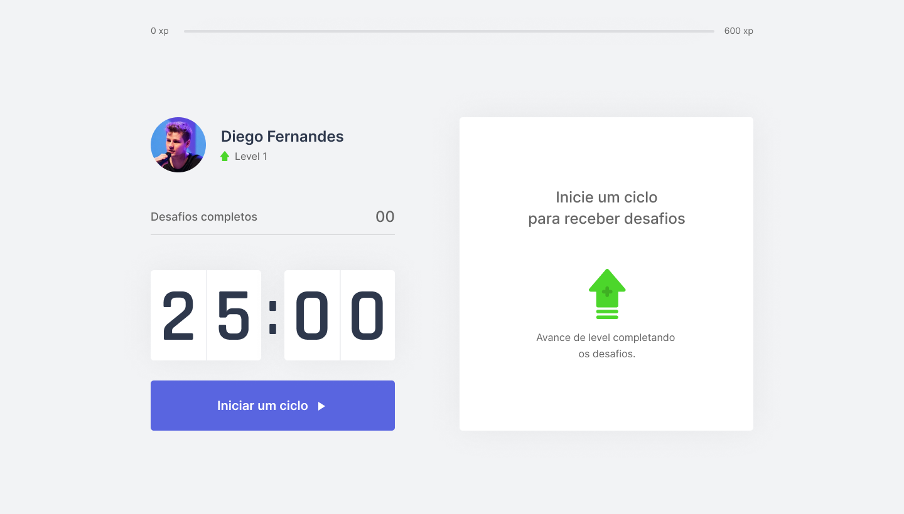
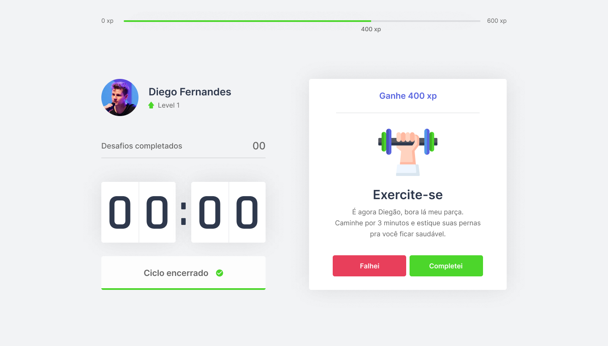

<h1 align="center">  MoveIt - NLW#4 </h1>

<h4 align="center"> 🚧 Em construção...  🚧 </h4>


<p align="center">
 <a href="#-sobre-o-projeto">Sobre</a> •
 <a href="#-funcionalidades">Funcionalidades</a> •
 <a href="#-layout">Layout</a> • 
 <a href="#-como-executar-o-projeto">Como executar</a> • 
 <a href="#-tecnologias">Tecnologias</a> • 
 <a href="#-autora">Autora</a> 
</p>


## 💻 Sobre o projeto

MoveIt foi criado com o intuito de ajudar pessoas que passam muito tempo em frente ao computador a realizar uma pausa e fazer uma atividade durante um determinado período.
A cada atividade concluída o usuário recebe um XP e assim vai aumentando de nível ao atingir a meta máxima.

O MoveIt é um projeto que está sendo desenvolvido na NLW#4 realizado pela Rocketseat e ministrada pelo CTO Diego Fernandes. O NLW é uma experiência online com muito conteúdo prático, desafios e hacks onde o conteúdo fica disponível durante uma semana.


## ⚙️ Funcionalidades

- [x] Experience Bar
- [x] Profile
- [x] Completed Challenge
- [x] Countdown
  - [x] Iniciar ciclo
  - [x] Abandonar ciclo
  - [x] Finalizar ciclo
- [ ] Definir desafios
- [ ] Aumentar level após completar os desafios


## 🎨 Layout

O layout da aplicação está disponível no Figma e foi feito pelo Tiago Luchtenberg:

<a href="https://www.figma.com/file/ge20pu3ofMOKoliUyKx1Nl/?viewer=1&node-id=160:2761">
  
</a>


### Web

<p align="center" style="display: flex; align-items: flex-start; justify-content: center;">
  

  
</p>


## 🚀 Como executar o projeto


### Pré-requisitos

Antes de começar, você vai precisar ter instalado em sua máquina as seguintes ferramentas:
[Git](https://git-scm.com), [Node.js](https://nodejs.org/en/). 
Além disto é bom ter um editor para trabalhar com o código como [VSCode](https://code.visualstudio.com/)


#### 🧭 Rodando a aplicação web (Frontend)

```bash

# Clone este repositório
$ git clone git@github.com:nayaracorrea/moveit-next.git

# Acesse a pasta do projeto no seu terminal/cmd
$ cd moveit-next

# Vá para a pasta da aplicação Front End
$ cd moveit-next

# Instale as dependências
$ npm install ou yarn install

# Execute a aplicação em modo de desenvolvimento
$ npm run dev ou yarn dev

# A aplicação será aberta na porta:3000 - acesse http://localhost:3000

```


## 🛠 Tecnologias

As seguintes ferramentes foram usadas na construção do projeto:


### **Website** ([Next.js](https://nextjs.org/) + [TypeScript](https://www.typescriptlang.org/))

-  **[React](https://pt-br.reactjs.org/)**
-  **[Node.js](https://nodejs.org/en/)**

> Veja o arquivo [package.json](https://github.com/nayaracorrea/moveit-next/blob/main/package.json)


## 💪 Como contribuir para o projeto

1. Faça um **fork** do projeto.
2. Crie uma nova branch com as suas alterações: `git checkout -b my-feature`
3. Salve as alterações e crie uma mensagem de commit contando o que você fez: `git commit -m "feature: My new feature"`
4. Envie as suas alterações: `git push origin my-feature`


## 🙋 Autora


<a href="https://app.rocketseat.com.br/me/nayaraflorentino-1602180404901">
 
 <br />
 <sub><b>Nayara Corrêa</b></sub></a> <a href="https://app.rocketseat.com.br/me/nayaraflorentino-1602180404901" title="Rocketseat">🚀
 </a>


Feito por Nayara Corrêa 👋🏽 Entre em contato!

[](https://www.linkedin.com/in/nayara-corr%C3%AAa-03bb91149/) 
[](mailto:nayara.florentino@gmail.com)
